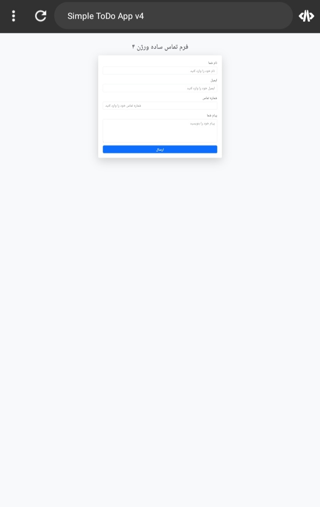

# Simple Contact Form V4

A simple Contact Form (Version 4) with validation and LocalStorage using HTML, Bootstrap, and JavaScript.

## Features
- Form validation for required fields
- Save submitted contacts to LocalStorage
- Show success and error messages
- Clear form after submission
- Responsive design using Bootstrap

## Screenshot

## How to Use
1. Open `index.html` in your browser
2. Fill out the form fields
3. Submit the form
4. Contacts are saved in LocalStorage and form is cleared

## Author
Farhad Akbary
